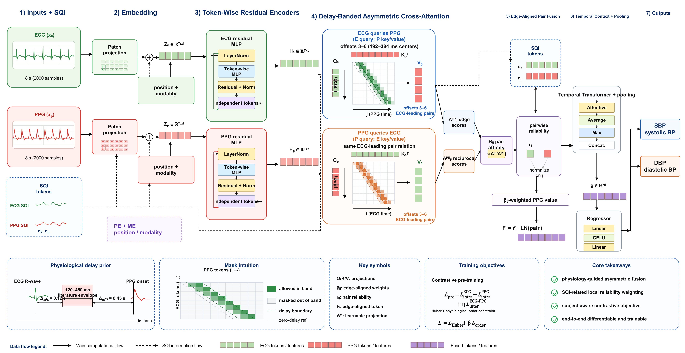
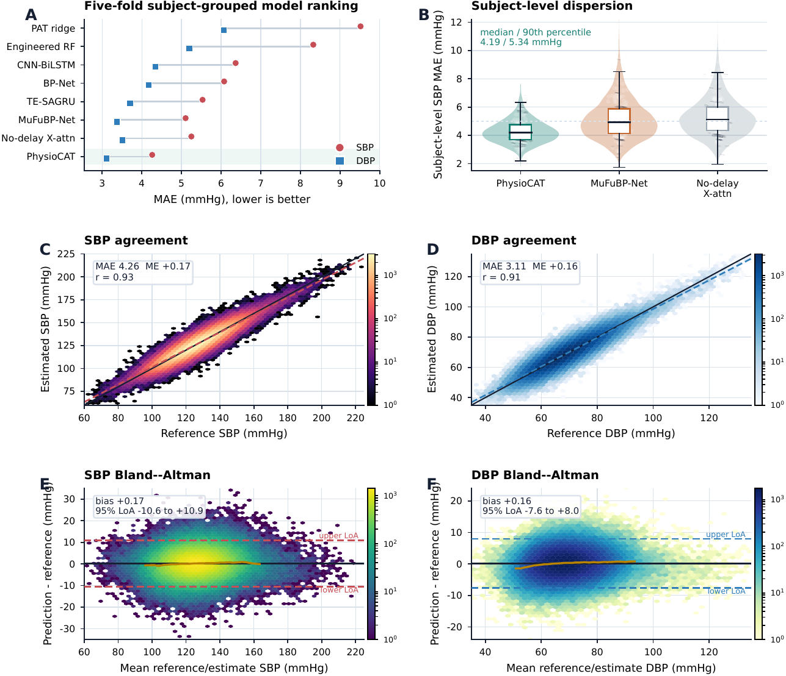

# PhysioCAT

[](https://github.com/shangyr/PhysioCAT/actions/workflows/validation.yml)
[](https://github.com/shangyr/PhysioCAT/releases/latest)
[](pyproject.toml)
[](LICENSE)

**Physiological delay-banded cross-attention for subject-independent cuffless
blood pressure estimation from ECG and PPG**

Youren Shang · Ningyuan Zhang (corresponding author) · Harbin Institute of Technology

PhysioCAT is a physiology-guided multimodal neural network that restricts
direct ECG--PPG attention to the ECG-leading 120--450 ms pulse-arrival
envelope. Reciprocal attention scores are aligned on the same physiological
edges, learned within the admissible band, and weighted by pairwise local
signal quality before temporal aggregation.

[Manuscript](paper/PhysioCAT_Manuscript.pdf) ·
[Supplement](paper/PhysioCAT_Supplementary_Material.pdf) ·
[Released checkpoint demo](#released-checkpoint-demo) ·
[Reproduce the study](#reproduce-the-study) ·
[Scientific contract](docs/SCIENTIFIC_CONTRACT.md) ·
[Reviewer guide](REVIEWER_GUIDE.md)

[](paper/figures/Figure_2.pdf)

*PhysioCAT architecture. Click the image for the submitted vector figure.*

## Core idea

Unconstrained fusion asks a finite dataset to rediscover both *which* ECG--PPG
timing relationships are physiologically admissible and *how strongly* each
admissible pair should interact. PhysioCAT fixes the first question as a
literature-guided structural prior and leaves the second learnable.

- **Physiology as an inductive bias.** ECG electrical activation is constrained
  to lead peripheral PPG pulse arrival; the model does not spend capacity on
  temporally implausible cross-modal pairs.
- **Edge-aligned reciprocal attention.** ECG-query/PPG-key and
  PPG-query/ECG-key branches score the same admissible ECG-leading pair, and
  their reciprocal affinity is fused once on that edge.
- **Pairwise reliability.** Scale-invariant ECG and PPG SQI tokens jointly
  weight each interaction, so a clean signal cannot conceal a corrupted
  partner.
- **Subject-independent evaluation.** The primary result uses fixed five-fold
  subject-grouped out-of-fold testing; frozen source models are then evaluated
  without target tuning on two patient-disjoint MIMIC-derived protocols.

## Main results

Results below are from retrospective public datasets. External rows use the
frozen PulseDB-Vital source model with no target-cohort tuning.

| Evaluation | Protocol | Windows / subjects | SBP MAE | DBP MAE |
|---|---|---:|---:|---:|
| **PhysioCAT, PulseDB-Vital** | 5-fold subject-grouped OOF | 186,252 / 2,714 | **4.26** | **3.11** |
| Matched no-delay cross-attention | Same folds, inputs, and parameters | 186,252 / 2,714 | 5.25 | 3.51 |
| **PhysioCAT, PulseDB-MIMIC** | Frozen zero-shot transfer | 164,882 / 2,201 | **4.95** | **3.52** |
| **PhysioCAT, MIMIC-BP** | Frozen zero-shot transfer | 39,498 / 1,524 | **4.83** | **3.41** |

All errors are in mmHg. Complete comparator results, uncertainty estimates,
subject-level tests, agreement analyses, and mechanism controls are released
under [`artifacts/metrics/`](artifacts/metrics/).

[](paper/figures/Figure_3.pdf)

*Primary subject-grouped performance and agreement. Click for the submitted
vector figure.*

## What is released

- the complete PhysioCAT implementation and matched neural/classical controls;
- fixed configurations, subject-disjoint folds, and executable data adapters;
- complete prediction authorities for every reported result;
- selected outer-fold and frozen source-model checkpoints with audit tensors;
- training histories, run ledgers, statistical outputs, source tables, and
  figure-reproduction code;
- a deterministic SHA-256 inventory and continuous Linux validation.

The release therefore supports three levels of use: inspect the algorithm,
execute a released checkpoint immediately, or reconstruct the full reported
evidence chain.

## Quick start

```bash
git clone https://github.com/shangyr/PhysioCAT.git
cd PhysioCAT
python -m pip install -r requirements/requirements-lock.txt
python -m pip install -e . --no-deps
```

The lock file records the exact direct dependency versions used in clean-room
validation. Python 3.10 or newer is supported; CI validates the release on
Python 3.11/Linux.

## Released checkpoint demo

Run the frozen PhysioCAT source checkpoint on its eight self-contained audit
windows:

```bash
python examples/released_checkpoint_demo.py
```

The command writes nothing. It loads the released deterministic checkpoint,
runs ECG/PPG/SQI inference, compares the outputs with the archived prediction
authority, and prints the maximum absolute replay difference. The audit
windows are an integrity fixture, not a performance benchmark.

For a legally obtained and prepared target cohort, use
[`scripts/train/predict_source_model.py`](scripts/train/predict_source_model.py).
Its input contract is 8-s ECG and PPG windows sampled at 250 Hz, represented as
`[batch, 1, 2000]`, with local SQI tokens shaped `[batch, 2, 125]`.

## Reproduce the study

Run the complete reviewer-facing workflow:

```bash
python scripts/reproduce/reproduce_all.py
python -m pytest -q tests
```

The workflow recomputes released tables, statistics, secondary analyses,
attention summaries, submitted figures, checkpoint replays, training-lineage
audits, and package hashes. Outputs are written to `reports/reproduced/`;
reference artifacts are never modified.

Useful focused entry points are:

| Goal | Command |
|---|---|
| Main and external tables | `python scripts/reproduce/reproduce_main_tables.py` |
| Submitted figures | `python scripts/reproduce/reproduce_figures.py` |
| Checkpoint and training lineage | `python scripts/reproduce/verify_training_lineage.py` |
| Subject/fold integrity | `python scripts/reproduce/verify_fold_membership.py` |
| Statistical analyses | `python scripts/reproduce/reproduce_statistics.py` |

## Repository map

```text
PhysioCAT/
├── src/physiocat/          model, preprocessing, training, metrics
├── configs/                fixed data, model, training, evaluation settings
├── scripts/data/           adapters for legally obtained source datasets
├── scripts/train/          subject-grouped and source-model workflows
├── scripts/reproduce/      tables, figures, statistics, and audits
├── artifacts/              predictions, checkpoints, metrics, provenance
├── data/                   fixed folds, manifests, retention, small fixtures
├── paper/                  submitted manuscript, supplement, vector figures
└── tests/                  implementation and release-contract verification
```

## Evidence by design

- Every primary subject is held out exactly once under the fixed subject-grouped
  protocol; the random-segment split is released only as a protocol-sensitivity
  control.
- The main no-delay control matches PhysioCAT's trainable parameters and differs
  only in the cross-attention support policy.
- Degree-preserving rewiring, shifted-band, direction, uniform-affinity, timing,
  normalization, and SQI controls separate physiological timing from generic
  sparsity or added attention capacity.
- External predictions are bound to frozen source checkpoints and patient-level
  source/target identity audits.
- Reference ABP is never a model or inference input; it is used only to derive
  or audit labels.

The concise [reviewer guide](REVIEWER_GUIDE.md) maps claims to files and
commands. The [scientific contract](docs/SCIENTIFIC_CONTRACT.md) records the
complete data, model, protocol, and release boundaries without overloading the
project homepage.

## Data access

Raw PulseDB and MIMIC-BP waveforms are not redistributed. The released adapters
operate on local copies obtained under the source repositories' access and
data-use terms. Fixed folds, de-identified lineage hashes, predictions,
checkpoints, audit fixtures, and derived evidence required to inspect the paper
are included here.

## Citation

If this repository supports your work, please cite the associated manuscript
and the software release described in [`CITATION.cff`](CITATION.cff). GitHub's
**Cite this repository** menu exports the software citation metadata.

## Funding and acknowledgments

This work was supported in part by the National Natural Science Foundation of
China [grant number 72125001]. The authors thank Professor Xitong Guo for
providing the research environment and institutional support in which this work
was conducted. The funding source had no role in the study design, analysis,
interpretation, manuscript preparation, or decision to submit the work for
publication.

## License and immutable snapshot

Code is released under the [BSD 3-Clause License](LICENSE). Dataset access and
use remain governed by the original data providers.

The final submission state is fixed by the immutable annotated tag
[`bspc-submission-v1`](https://github.com/shangyr/PhysioCAT/tree/bspc-submission-v1)
and its GitHub
[Release](https://github.com/shangyr/PhysioCAT/releases/tag/bspc-submission-v1).
See [`VERSIONING.md`](VERSIONING.md).
